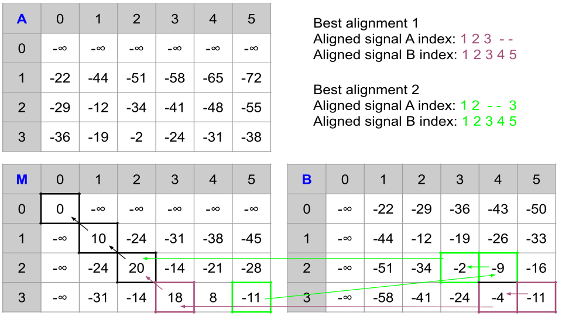

@mainpage %DIAlign: Alignment of MS/MS chromatograms  
@tableofcontents

Data Independent Acqusition (DIA) is a widely used method in mass-spectrometry based proteomics. DIAlign is a software for the alignment of MS/MS chromatograms across runs. We have DIAlign namespace that includes functions for building similarity matrix from raw MS2 chromatograms. On the similarity matrix,  affine-alignment is performed using dynamic programming. Aligned indices, alignment path through the matrix and intermediate cumulative scoring matrices are included in the alignment object. 

@section section0 MS/MS Chromatogram group
A chromatogram is a time-series signal with time and intensity. We define a group as a collection of chromatograms having the same time values. The algorithm aligns a chromatogram group from run A to the same of run B. Both groups must contain the same number of chromatograms.

@section section1 Similarity Matrix

The first step is to build a similatry score matrix between both chromatogram groups. Function @link DIAlign::SimilarityMatrix::getSimilarityMatrix getSimilarityMatrix @endlink returns the score matrix. Following similarity score methods are implemented: *dotProductMasked*, *dotProduct*, *cosineAngle*, *cosine2Angle*, *euclideanDist*, *covariance*, *correlation*.

@subsection subsection1 Gap Penalty

Gap penalty is calculated from the distribution of similarity scores. @link DIAlign::getGapPenalty getGapPenalty @endlink function calculates the penalty score as a certain quantile value from the similarity score distribution.

@subsection subsection2 Constraint

The hybrid alignment requires constraing the similarity matrix to avoid a large drift. To achieve this a constraining function is calculated externally and scores outside the certain distance from this function is penalized. @link DIAlign::ConstrainMatrix ConstrainMatrix @endlink has functions to implement it. In the given example below, scoring matrix is represented as a grid between (A1, B1) and (A2, B2). `X` represents unconstrained scores, whereas, whitespace region is constrained.

@verbatim
    B1              B2
  A1 +---------------+
     |XX             |
     | XXX           |
     |  XXX          |
     |   XXX         |
     |    XXX        |
     |     XXX       |
     |      XXX      |
     |       XXX     |
  A2 +---------------+
@endverbatim

@section section2 Affine alignment
We use dynamic programming for finding highest-scoring path through the score matrix. To avoid execursions in horizontal or vertical direction, affine-alignment is used with low gap-opening penalty and high gap-extension penalties.

Given a similarity score matrix s of size n x m, or affine-alignment we calculate three matrices M, A and B each of size (n+1) x (m+1).   
* Matrix M stores the highest score for the alignment of Ai to Bj.   
* Matrix A stores the best score for the alignment of Ai to Bj given Ai is aligned to a gap.   
* Matrix B stores the highest score for the alignment of Bj to Ai, given Bj is aligned to a gap.    

Example:  We have following similarity matrix. Gap opening penalty = 22, gap extension penalty = 7      
s | 1 | 2 | 3 | 4 | 5
--|--|--|--|--|---
1 | 10 | -2 | -2 | -2 | -2
2 | -2 | 10 | -2 | -2 | -2
3 | -2 | -2 | -2 | 10 | -2

@subsection subsecce Initialization
The corresponding M, A and B matrices are initialized with some set of rules for overlap and non-overlap alignment. See initialization for @ref Init_section1 and @ref Init_section2 for our example. 

@subsection subsection3 Best score calculation

Highest score for each cell is calculated using the following equations:
\f$ M_{i,j} = max \left\{\begin{matrix} M_{i-1,j-1} + s_{i,j} \\ A_{i-1,j-1} + s_{i,j} \\ B_{i-1,j-1} + s_{i,j} \end{matrix}\right\} \f$

\f$ A_{i,j} = max \left\{\begin{matrix} M_{i-1,j} - gapOpen \\ A_{i-1,j} - gapExtension \\ B_{i-1,j} - gapOpen \end{matrix}\right\} \f$

\f$ B_{i,j} = max \left\{\begin{matrix} M_{i,j-1} - gapOpen \\ A_{i,j-1} - gapOpen \\ B_{i,j-1} - gapExtension \end{matrix}\right\} \f$

It is clear that these matrices restricts the direction. Matrix M only allows diagonal path (upperleft to downright), matrix A allows up to down and matrix B permits left to right path only.
  The example matrices are presented for @ref Matrices_section1 and @ref Matrices_section2 .

@subsection subsection4 Traceback

After calculating best cumulative score, we perform traceback and get the alignment path.

Alignment paths for Overlap alignment:

Alignment paths for non-Overlap alignment:

@see 
 * Gupta S, Ahadi S, Zhou W, Röst H. "DIAlignR Provides Precise Retention Time Alignment Across Distant Runs in DIA and Targeted Proteomics." Mol Cell Proteomics. 2019 Apr;18(4):806-817. doi: https://doi.org/10.1074/mcp.TIR118.001132 Epub 2019 Jan 31.
 * CNPN 2018 Poster doi: https://doi.org/10.6084/m9.figshare.6200837.v1
 * HUPO 2018 Poster doi: https://doi.org/10.6084/m9.figshare.7121696.v2
 * https://www.coursera.org/lecture/bioinformatics-pku/alignment-with-affine-gap-penalty-and-calculation-of-time-complexity-of-the-0ya7X
 * https://www.cs.cmu.edu/~ckingsf/bioinfo-lectures/gaps.pdf
 * Biological Sequence Analysis (Chapter 2) by Durbin, Eddy, Krogh, and Mitchison.
